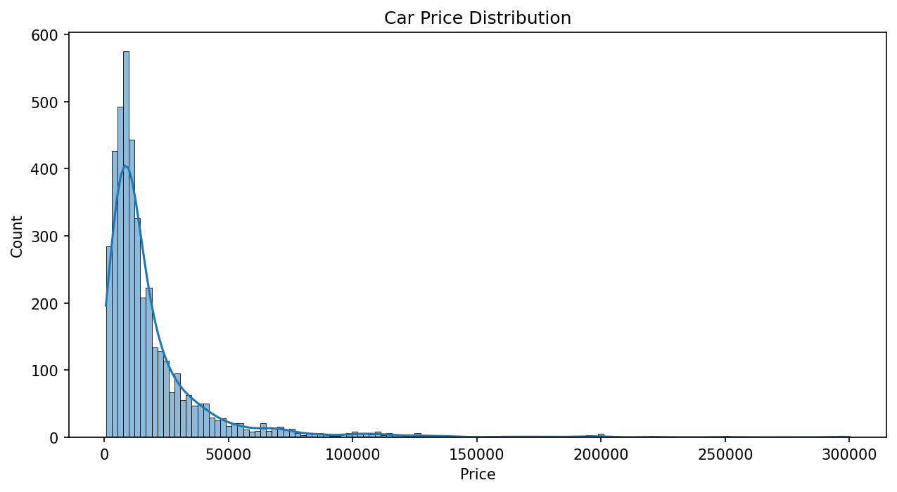
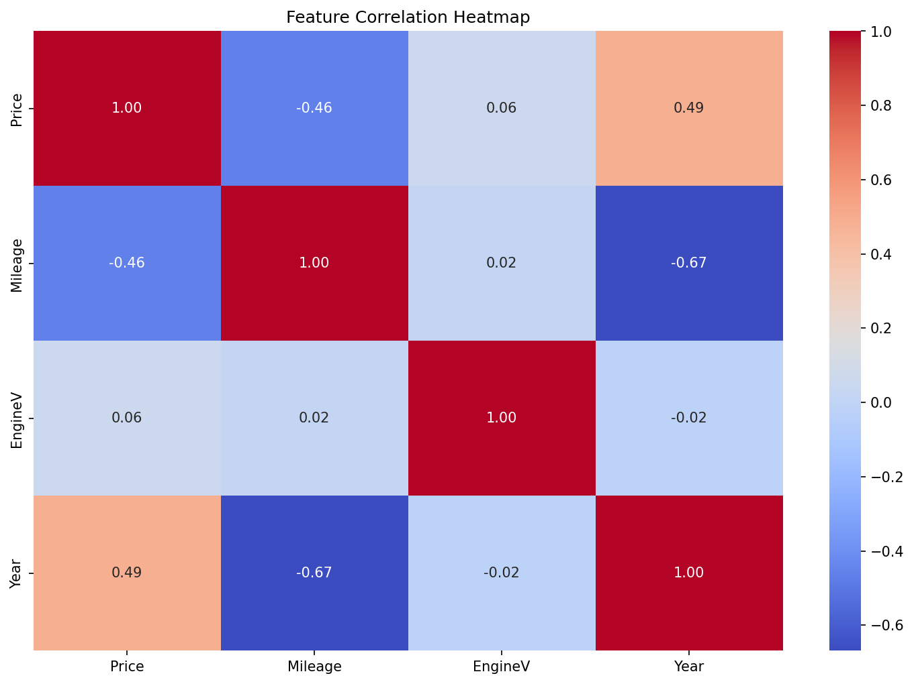
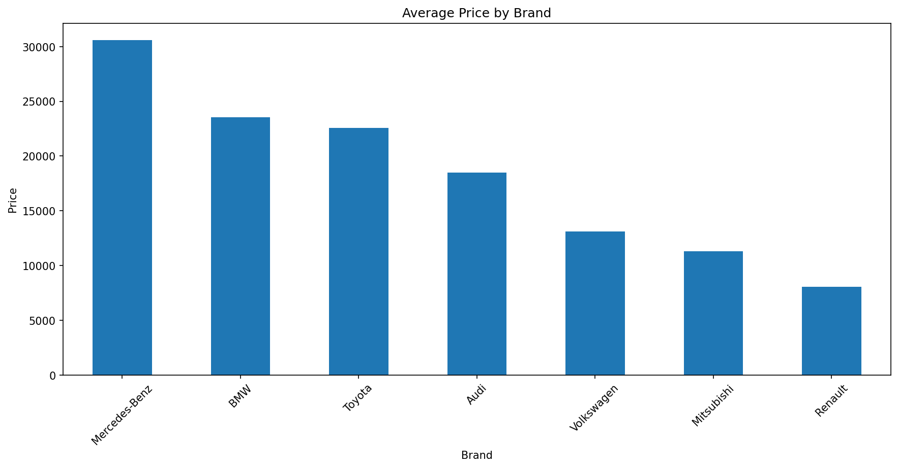
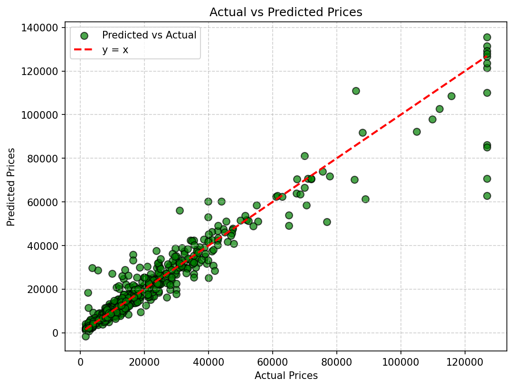

# Car Price Prediction

Predicting used car prices based on brand, mileage, engine volume, year, and other vehicle features using machine learning.

**Dataset:** Used Car Sales — 4,345 records, 9 features  
**Type:** Regression  
**Stack:** Python · Pandas · Scikit-learn · XGBoost  

---

## Features

- **Data Preprocessing:** Outlier clipping (1st–99th percentile).
- **Feature Engineering:** `Car_Age_2026`, `Mileage_per_Year`, `Brand_Power`.
- **Pipeline:** `RobustScaler` + `OneHotEncoder` + `XGBRegressor`.
- **Optimization:** Hyperparameter tuning with `GridSearchCV` (cv=5).

---

## Results

| Model | R² | RMSE | MAE |
|---|---|---|---|
| Linear Regression | 0.6739 | 11,595 | 6,212 |
| XGBoost Default | 0.9163 | 5,874 | 2,703 |
| XGBoost Tuned | **0.9268** | **5,492** | **2,545** |

---

## Visualizations

### Price Distribution


### Feature Correlation Heatmap


### Average Price by Brand


### Actual vs Predicted


---

## How to Run

```bash
pip install -r requirements.txt
jupyter notebook 01-car-price-prediction.ipynb