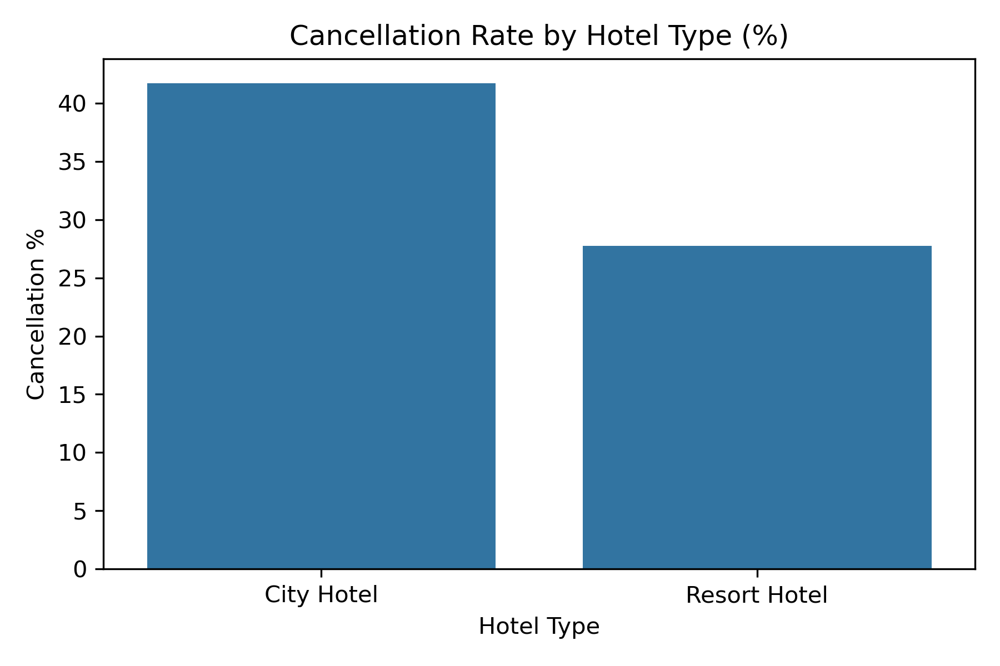
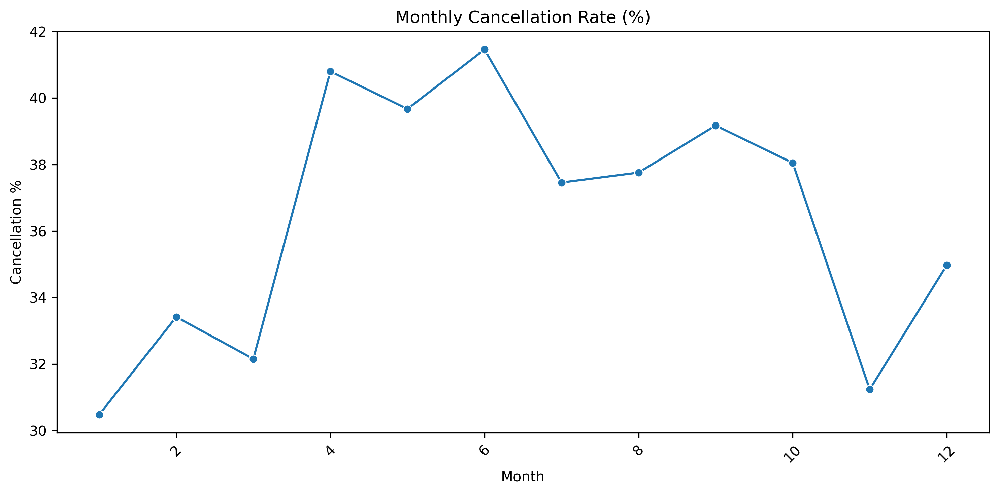
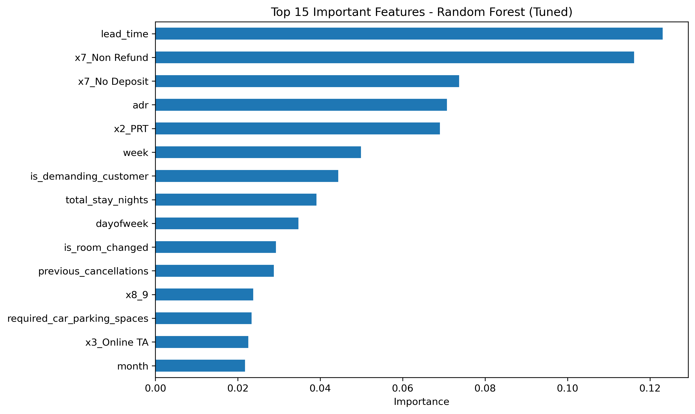
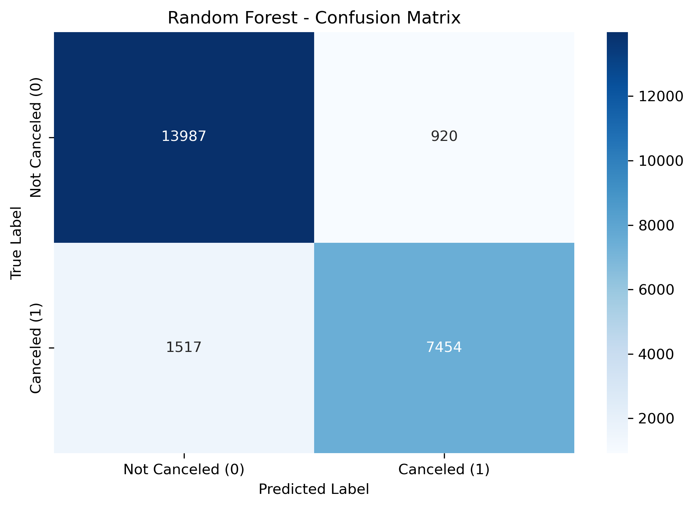
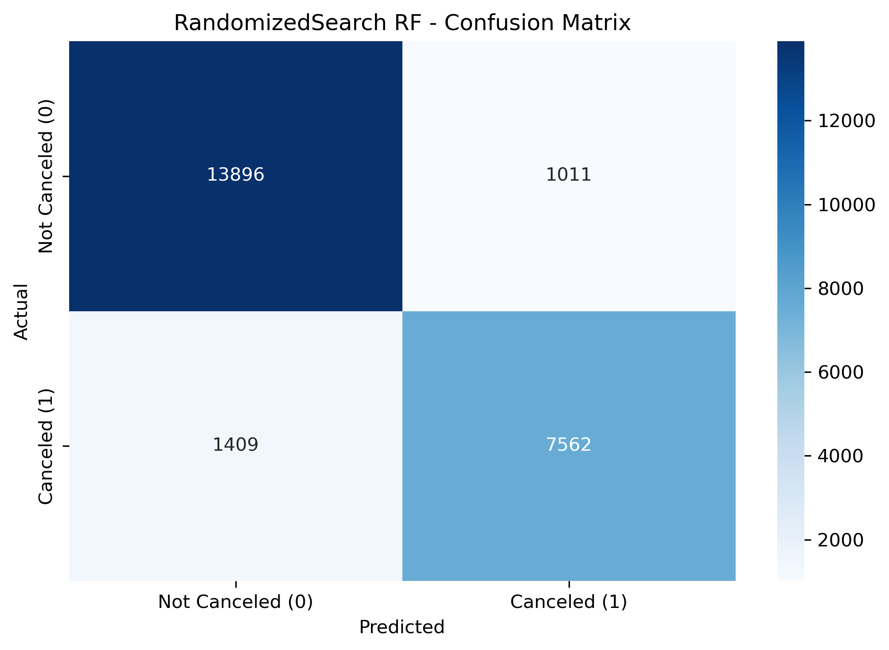

# Hotel Booking Cancellation Analysis

Predicting hotel booking cancellations to extract actionable insights for revenue management, reduce losses, and understand customer booking patterns.

**Dataset:** Hotel Booking Demand — 119,390 records  
**Type:** Classification (`is_canceled`)  
**Stack:** Python · Scikit-learn · Random Forest · XGBoost  

---

## Features & EDA

- **Feature Engineering:** Added variables like `total_guests`, `total_stay_nights`, `is_company_booking`, and `is_demanding_customer`.
- **Key Insights:** 
  - Overall cancellation rate: **37.04%** (City Hotel: 41.73%, Resort Hotel: 27.76%).
  - Median lead time is significantly higher for canceled bookings (113 days) compared to non-canceled ones (45 days).
- **Optimization:** Hyperparameter tuning using `RandomizedSearchCV` (cv=5, 30 candidates).

---

## Results

| Model | Accuracy |
|---|---|
| Logistic Regression | 0.8343 |
| XGBoost | 0.8713 |
| Random Forest | 0.8979 |
| Tuned Random Forest | **0.8987** |

*Tuned RF Best Parameters: `n_estimators`: 300, `max_depth`: None, `min_samples_leaf`: 1, `max_features`: 0.3*

---

## Visualizations

### Cancellation Rate by Hotel Type


### Monthly Cancellation Rate


### Feature Importance


### Confusion Matrix (Baseline Random Forest)


### Confusion Matrix (Tuned Random Forest)


---

## How to Run

```bash
pip install -r requirements.txt
jupyter notebook 02-hotel-booking-cancellation.ipynb