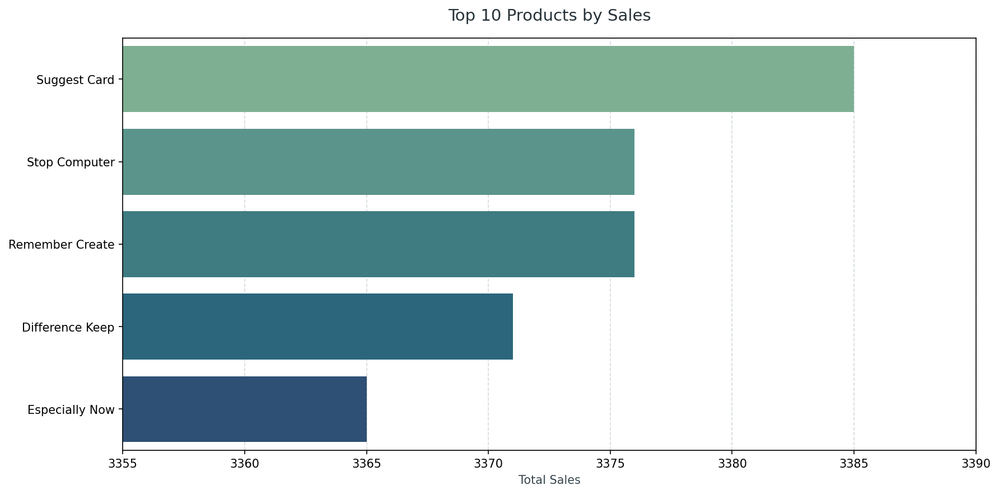
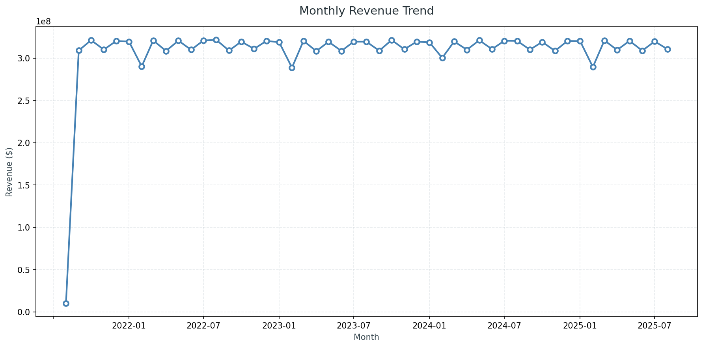
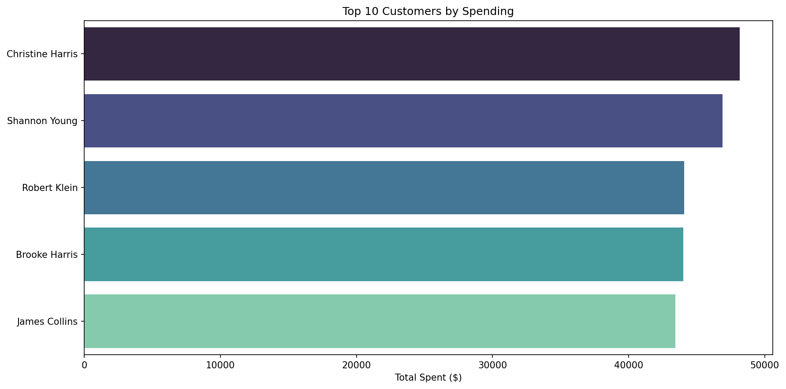
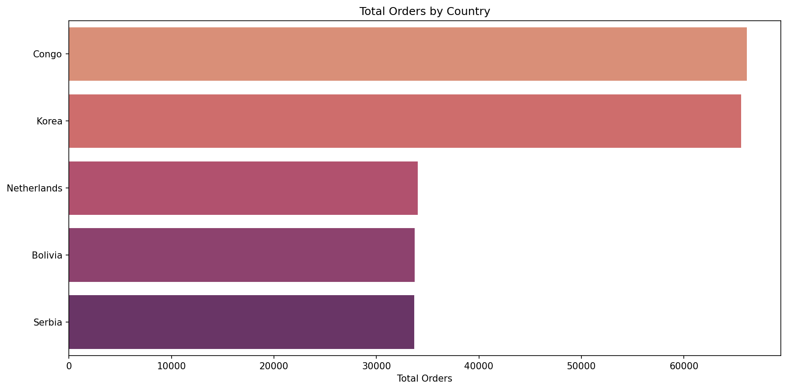
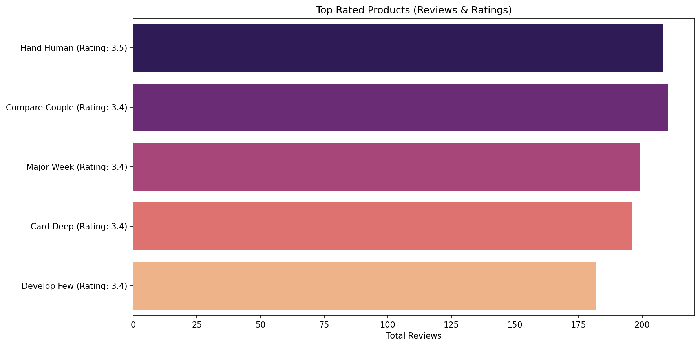

# E-Commerce SQL Analysis

Analyzing a synthetic relational e-commerce database to uncover 
sales trends, customer behavior, and product performance using SQL and Python.

**Dataset:** [Synthetic E-Commerce Relational Dataset](https://www.kaggle.com/datasets/naelaqel/synthetic-e-commerce-relational-dataset)  
**Type:** SQL Analysis + Visualization  
**Stack:** PostgreSQL · Python · Pandas · Matplotlib · Seaborn

---

## Database Schema

| Table | Description |
|---|---|
| `customers` | Customer profiles and locations |
| `orders` | Order headers with status and amount |
| `order_items` | Order line items with quantity and price |
| `products` | Product catalog with category and price |
| `product_reviews` | Customer ratings and reviews |

---

## Key Questions Answered

| Question | Finding |
|---|---|
| Best-selling product | Suggest Card (3,385 units) |
| Top customer | Christine Harris ($48,000+) |
| Most orders by country | Congo |
| Revenue trend | Stable ~$310M/month from 2022 |
| Highest rated product | Hand Human (3.5 avg rating) |

---

## Visualizations

### Top Products by Sales

### Monthly Revenue Trend

### Top Customers by Spending

### Orders by Country

### Top Rated Products

---

## SQL Queries

All queries are in the [`sql/`](./sql/) folder.
Each query is documented with comments explaining the logic.